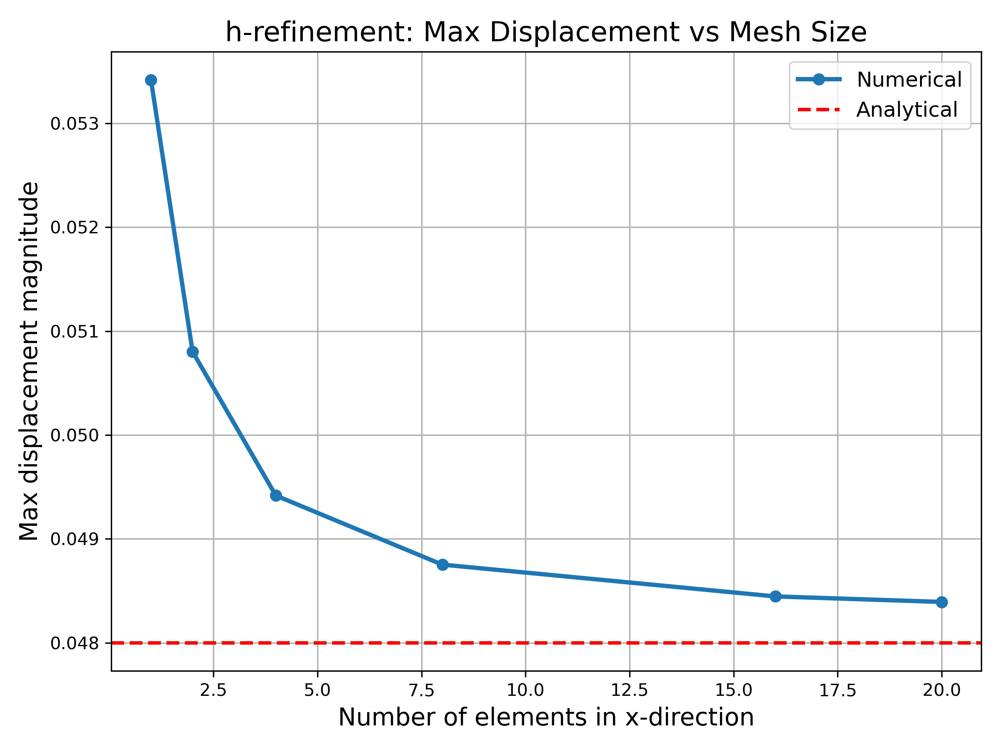
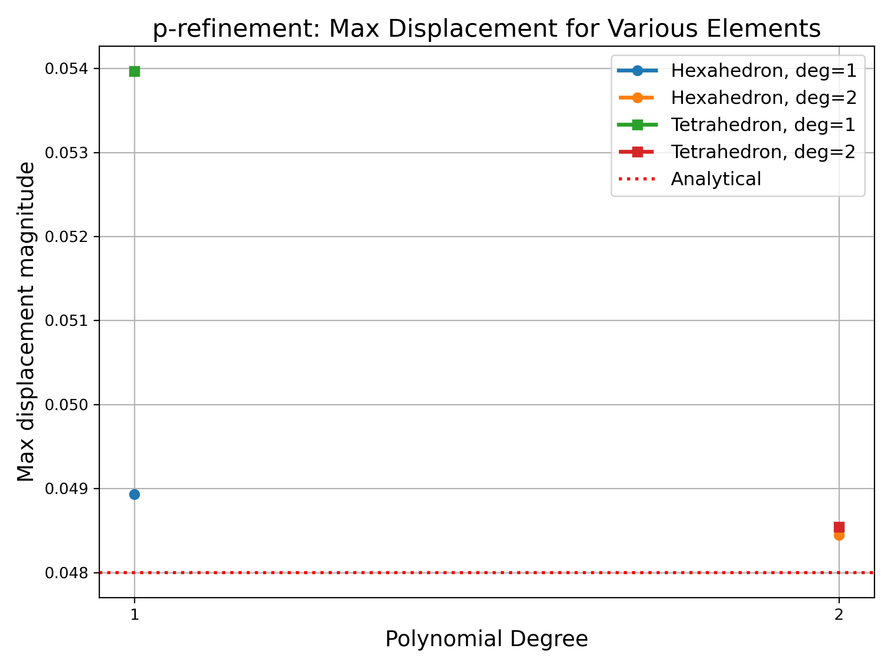
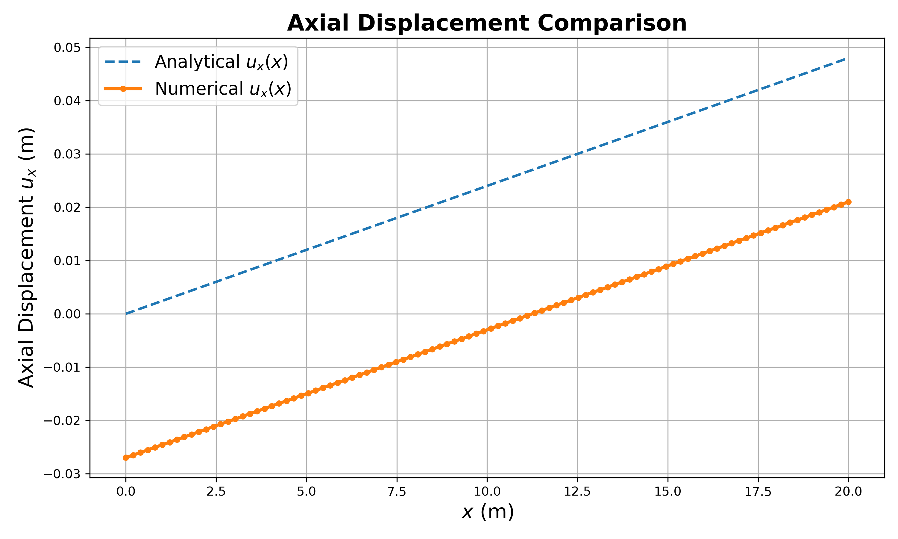
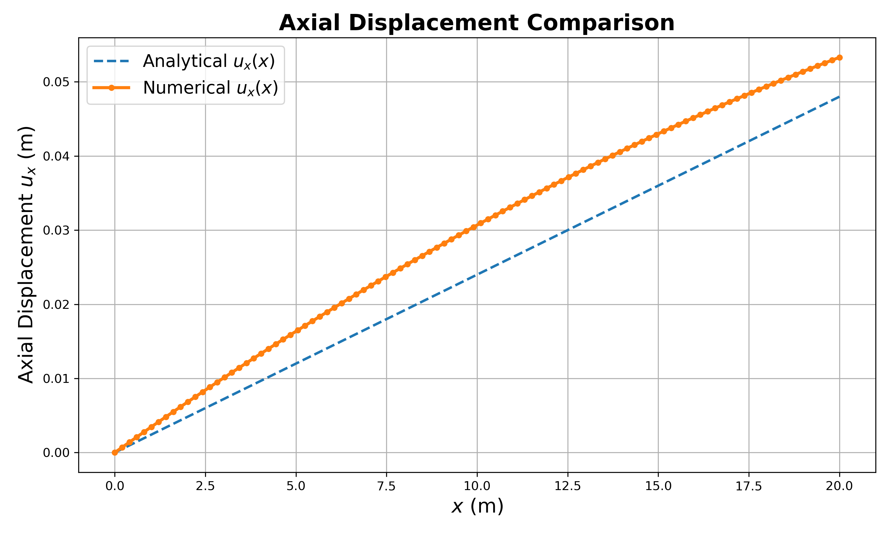

# ME700_Assignment4Part2


Problem related to **thermal expansion with linear elasticity** was implemented. The most of the code structure was borrowed from the [hyperelasticity example](https://github.com/Lejeune-Lab-Graduate-Course-Materials/fenicsX/blob/main/hyperelasticity_beam.py).

## Instructions for running the script

### Installing FEniCSx on the SCC

```bash
module load miniconda
mamba create -n fenicsx-env
mamba activate fenicsx-env
mamba install -c conda-forge fenics-dolfinx mpich pyvista
pip install imageio
pip install gmsh
pip install PyYAML
```

### Running the scripts on VSCode Server
Launch VSCode Server.\
Open terminal in VSCode.\
Run the following commands one by one in the termainal to clone the repository (after moving to the desired directory):

```bash
git clone https://github.com/rishabh022298/ME700_Assignment4Part2.git
```
Change the folder:
```bash
cd ME700_Assignment4Part2
```
Activate fenicsx-env:
```bash
conda activate fenicsx-env
```
**Note:** If you are running into some memory related error then try relaunching the server after closing the session.

### File names

#### Part 1: Analytical vs Numerical
This can be found [here](https://github.com/rishabh022298/ME700_Assignment4Part2/blob/main/p1_analytical_vs_num.py)
```bash
python p1_analytical_vs_num.py
```

This generates two files:
- P1_analytical_vs_numerical.png: Plot comparing the numerical results with analytical.
- P1_deformation.gif: Animated scene showing deformation
  
#### Part 2: h and p refinement
Scipt for h-refinement can be found [here](https://github.com/rishabh022298/ME700_Assignment4Part2/blob/main/p2_h_refinement.py)
```bash
python p2_h_refinement.py
```

This generates:

- P2_h_refinement.png: Showing convergence using h-refinement
  
Script for p-refinement can be found [here](https://github.com/rishabh022298/ME700_Assignment4Part2/blob/main/p2_p_refinement.py)
```bash
python p2_p_refinement.py
```

This generates:
- P2_p_refinement.png: Showing convergence using p-refinement

#### Part 3: FEA Code Failure
Script for first example using boundary free system can be found [here](https://github.com/rishabh022298/ME700_Assignment4Part2/blob/main/p3_free_boundaries.py)
```bash
python p3_free_boundaries.py
```

This generates:
- P3_free_boundaries_axial_displacement_comparison.png
- P3_free_boundaries_deformation.gif
  
Script for second example using poor mesh can be found [here](https://github.com/rishabh022298/ME700_Assignment4Part2/blob/main/p3_poor_mesh.py)
```bash
python p3_poor_mesh.py
```

This generates:
- P3_poor_mesh_axial_displacement_comparison.png
- P3_poor_mesh_deformation.gif

**Note:** Please make sure to referesh "EXPLORER" to check out the plots and gifs that are generated after running the scripts.

## Theory and Results

### Thermal Expansion with Linear Elasticity
User can refer to Theory of Elasticity by Timoshenko and Goodier. The following theory was derived from the third edition of the same book (p 442).

Now, axial strains:

$$e_{xx} = \epsilon_{xx} + \alpha\Delta T$$

here:
- $e_{xx}$ = Total strain in $x$ (axial) direction.
- $\epsilon_{xx}$ = Strain due to elasticity.
- $\alpha$ = coefficient of thermal expansion.
- $\Delta T$ = change in temperature. 

Now, $e_{xx}$ can be related to displacement (in linear elasticity) as:

$$e_{xx} = \frac{\partial u_x}{\partial x}$$

where:
- $u_x$ is the displacement in $x$ direction

Since the problems implemented in the scripts are related to free expansion, therefore

$$\epsilon_{xx} = 0$$

Combining all three equations from above, we get:

$$\frac{\partial u_x}{\partial x} = \alpha\Delta T$$

Integrating both sides with respect to $x$ gives the displacement along axial ($x$) direction. Rest of the formulation related to writing stresses, energy, residual, etc. is exactly the same as standard practice.

### Results

#### Analytical vs Numerical


We can see that the numerical result align really close to the analytical results.

#### h and p refinement

For h-refinement study, the lateral part of the domain was discretized into 5*5 grids and the number of elements along the axial direction were varied from 1 to 20.



It can be seen that the result starts converging very close to the analytical result as the mesh gets finer.

For p-refinement study, two element types with degree 1 and 2 were used
- Hexahedron element
- Tetrahedron element



It can be seen that the result gets closer to the analytical solution as the degree of element is increased. The change is much more prominent for tetrahedron element as compared to hexahedron.

#### Failure

We are trying to look at free expansion. But up until a boundary was fixed to simulate the system. Let's remove that boundary and get back to the equation $\frac{\partial u_{x}}{\partial x} = \alpha\Delta T$. Integrating both sides gives:

$$u_x = \alpha\Delta T x + C$$

Where $C$ is the constant of integration. FEniCS doesn't handle $C$ very well. For example, if we remove the fixed boundary condition at one end, we see:




Now, this one curve can be explained in one of the two ways:
- The bar expanded somewhat symmetrically so we have expansion in both directions and hence negative and positive displacements (which is untrue if we closely examine the plot). Or,
- There were rigid body displacements.

Both of these explanations are fine for understanding, but imagine if the temperature field or the body itself was not symmetric then it would be really hard to predict what actually happened. This would also lead to not only rigid body displacements but also rigid body rotations. Now imagine if we are solving something which expands over multiple time steps. Then it will be really hard to keep track of those symmetrical or asymmetrical expansions or rigid body movements or both. So, here it's not the case that FEniCS fails to solve the system or doesn't converges, but it fails to identify one of the simplest issue that may arise while solving the problems that doesn't have prescribed Dirichlet boundary conditions.

There are a couple of ways to get around it:
- Fix some nodes which you expect will have least amount of effect on the solution.
- Introduce [Lagrange multipliers](https://en.wikipedia.org/wiki/Lagrange_multiplier) as a penalty for rigid body movements.

Similarly, if we look at the expression $$u_x = \alpha\Delta T x$$, which seems so easy to access but it still requires a finer mesh to generate results which are acceptable. For e.g, if poor mesh is used, we get something like this:


