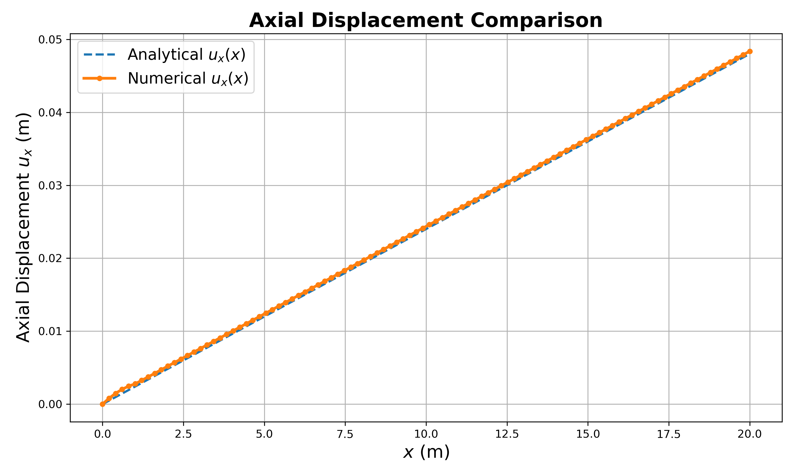

# ME700_Assignment4Part2


Problem related to **thermal expansion with linear elasticity** was implemented. The most of the code structure was borrowed from the [hyperelasticity example](https://github.com/Lejeune-Lab-Graduate-Course-Materials/fenicsX/blob/main/hyperelasticity_beam.py).

## Instructions for running the script

### Installing FEniCSx on the SCC

```bash
module load miniconda
mamba create -n fenicsx-env
mamba activate fenicsx-env
mamba install -c conda-forge fenics-dolfinx mpich pyvista
pip install imageio
pip install gmsh
pip install PyYAML
```

### Running the scripts on VSCode Server
Launch VSCode Server.\
Open terminal in VSCode.\
Run the following commands one by one in the termainal to clone the repository (after moving to the desired directory):

```bash
git clone https://github.com/rishabh022298/ME700_Assignment4Part2.git
```
Change the folder:
```bash
cd ME700_Assignment4Part2
```
Activate fenicsx-env:
```bash
conda activate fenicsx-env
```
**Note:** If you are running into some memory related error then try relaunching the server after closing the session.

### File names

#### Part 1: Analytical vs Numerical
This can be found [here](https://github.com/rishabh022298/ME700_Assignment4Part2/blob/main/p1_analytical_vs_num.py)
```bash
python p1_analytical_vs_num.py
```

#### Part 2: h and p refinement
Scipt for h-refinement can be found [here](https://github.com/rishabh022298/ME700_Assignment4Part2/blob/main/p2_h_refinement.py)
```bash
python p2_h_refinement.py
```
Script for p-refinement can be found [here](https://github.com/rishabh022298/ME700_Assignment4Part2/blob/main/p2_p_refinement.py)
```bash
python p2_p_refinement.py
```

#### Part 3: FEA Code Failure
Script for first example using boundary free system can be found [here](https://github.com/rishabh022298/ME700_Assignment4Part2/blob/main/p3_free_boundaries.py)
```bash
python p3_free_boundaries.py
```

Script for second example using poor mesh can be found [here](https://github.com/rishabh022298/ME700_Assignment4Part2/blob/main/p3_poor_mesh.py)
```bash
python p3_poor_mesh.py
```

**Note:** Please make sure to referesh "EXPLORER" to check out the plots and gifs that are generated after running the scripts.

## Theory and Results

### Thermal Expansion with Linear Elasticity
User can refer to Theory of Elasticity by Timoshenko and Goodier. The following theory was derived from the third edition of the same book (p 442).
Axial strains:

$$e_{xx} = \epsilon_{xx} + \alpha\Delta T$$

here:
- $e_{xx}$ = Total strain in $x$ (axial) direction.
- $\epsilon_{xx}$ = Strain due to elasticity.
- $\alpha$ = coefficient of thermal expansion.
- $\Delta T$ = change in temperature. 

Now, $e_{xx}$ can be related to displacement (in linear elasticity) as:

$$e_{xx} = \frac{\partial u_x}{\partial x}$$

where:
- $u_x$ is the displacement in $x$ direction

Since the problems implemented in the scripts are related to free expansion, therefore

$$\epsilon_{xx} = 0$$

Combining all three equations from above, we get:

$$\frac{\partial u_x}{\partial x} = \alpha\Delta T$$

Integrating both sides with respect to $x$ gives the displacement along axial ($x$) direction.


